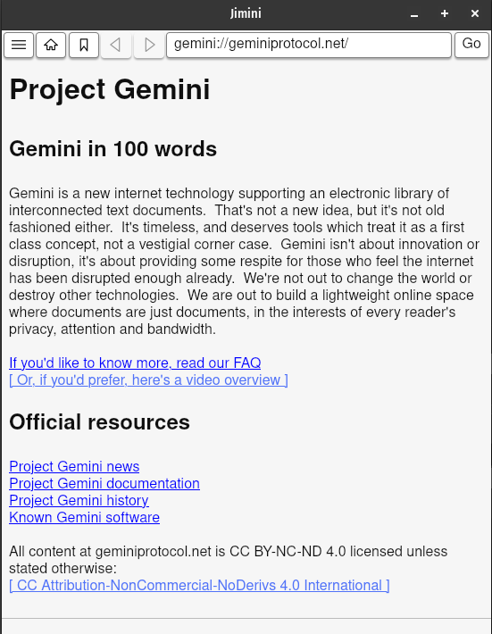

# Jimini

A multi-platform desktop Gemini client, written in Rust, using [Tauri](https://v1.tauri.app/). 

Copyright (c) 2024, 2025 Paul Sobolik

License [MIT](LICENSE)

## Screenshots
### Dark mode

### Light mode

